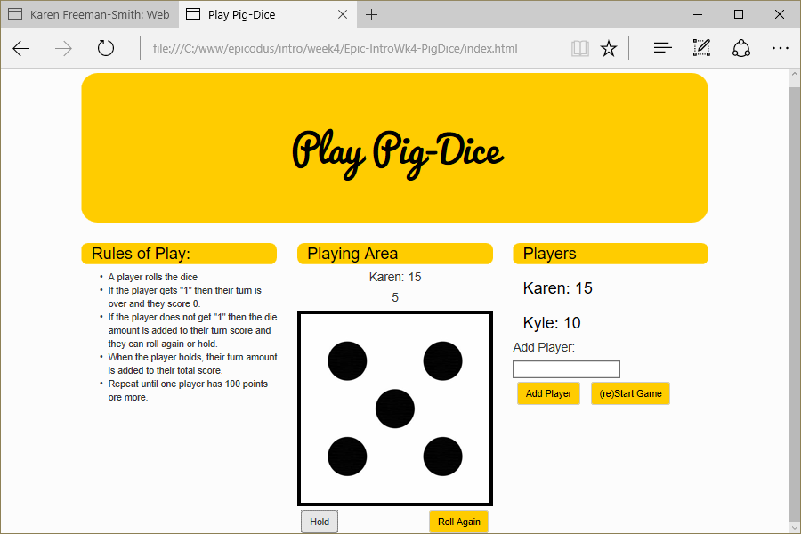

# Pig-Dice
Version 0.0.2: August 24, 2016
by [Karen Freeman-Smith](https://karenfreemansmith.github.io) and [Kyle Lange](https://github.com/kylelange)

### Technologies Used
HTML, CSS, Bootstrap, JavaScript, jQuery

## Description
*[Epicodus](http://epicodus.com) Intro to Programming Week 4 Pair Project with Kyle Lange: A web-based game of pig dice.*

## Setup/Installation
* [View on Github Pages](https://karenfreemansmith.github.io/Epic-IntroWk4-PigDice)
* _OR_
* Clone directory
* Open index.html in your favorite browser

## Support & Contact
For questions, concerns, or suggestions please email karenfreemansmith@gmail.com

## Specifications
Each turn, a player repeatedly rolls a die until either a 1 is rolled or the player decides to "hold":
  * If the player rolls a 1, they score nothing and it becomes the next player's turn.
  * If the player rolls any other number, it is added to their turn total and the player's turn continues.
  * If a player chooses to "hold", their turn total is added to their score, and it becomes the next player's turn.
The first player to score 100 or more points wins.

*Spec 1: the program will roll a d6 randomly, accumulate the die rolls.
  * Input: a random number from 1 - 6: (3)
  * Output: score = score + new random number (0 + 3 = 3)*
*Spec 2: Be able to add on player
  * Input: Name: Karen
  * Output: return "Karen"*
*Spec 3: Assign the player a score
  * Input: 3
  * Output: Karen Score = 3*
*Spec 4: End turn if the player rolls a 1
  * Input: dice = 1
  * Output Temp Score = 0*
*Spec 5: End turn if the player holds
  * Input: Player holds on (3)
  * Output: player score = player score + temp score (3 + 3 = 6)*
*Spec 6: End the game when a player score >= 100.
  * Input: temp score = 6
  * Output: player score + temp score >= 100 (96 + 6 = 102)*

## Known Issues
* None

## Legal
*Licensed under the GNU General Public License v3.0*

Copyright (c) 2016 Copyright _[Karen Freeman-Smith](https://karenfreemansmith.github.io) & [Kyle Lange](https://github.com/kylelange)_ All Rights Reserved.
